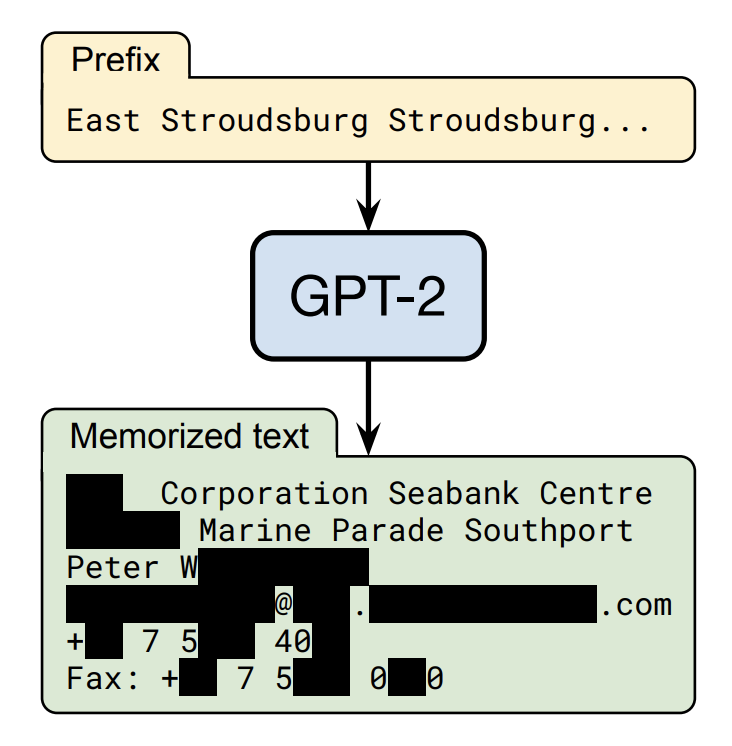
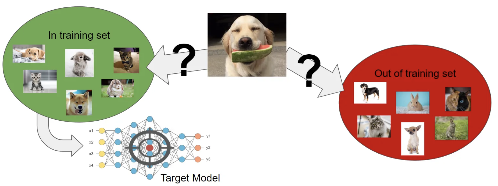
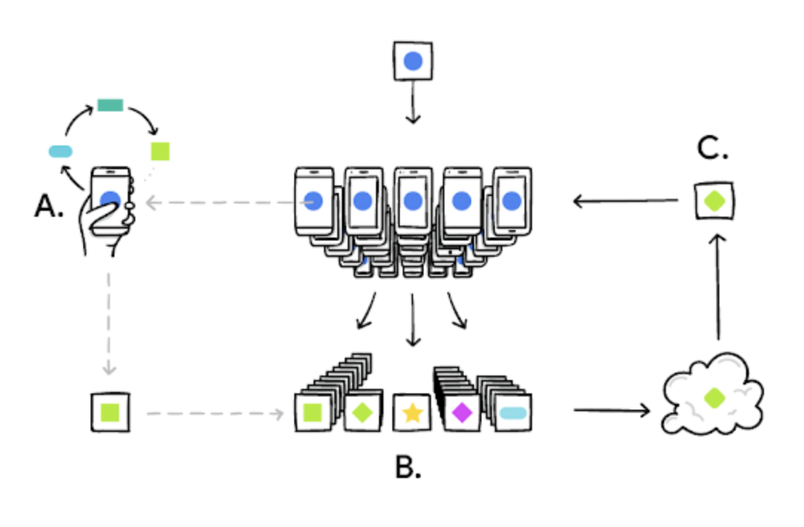
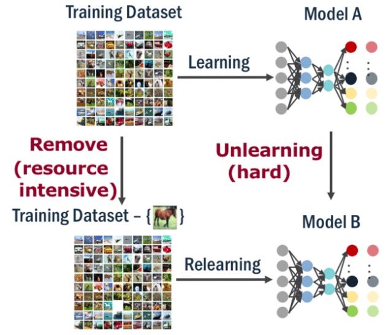
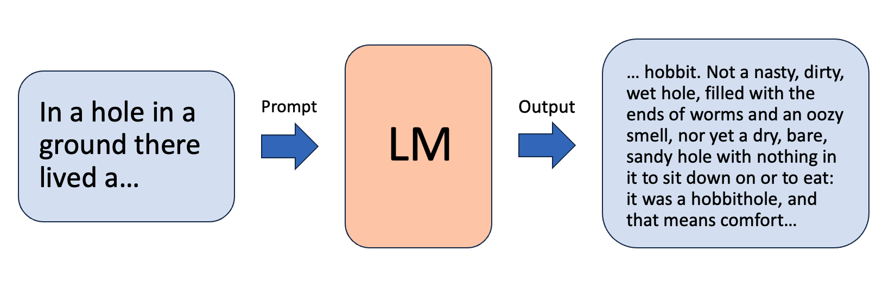

# Privacy Issues in Large Language Models

This repository is a collection of links to papers and code repositories relevant in implementing LLMs with reduced privacy risks. 
These correspond to papers discussed in our survey available at: https://arxiv.org/abs/2312.06717

This repository will be periodically updated with relevant papers scraped from Arxiv. The survey paper itself will be 
updated on a slightly less frequent basis. **Papers that have been added to this repository but not the paper will be
marked with asterisks.**

If you have a paper relevant to LLM privacy, [please nominate them for inclusion](https://forms.gle/jCZgXaEfb8R4CnDb7) 

*Repo last updated 1/5/2024*
*Paper last updated 11/02/2023*

## Table of Contents

- [Privacy Risks of LLMs](#privacy-risks-of-large-language-models)
  - [Memorization](#memorization)
  - [Privacy Attacks](#privacy-attacks)
  - [Private LLMs](#private-llms)
  - [Unlearning](#unlearning)
  - [Copyright](#copyright)
- [Additional Relevant Surveys](#additional-relevant-surveys)
- [Contact Info](#contact-info)


## Citation

```
@misc{neel2023privacy,
      title={Privacy Issues in Large Language Models: A Survey}, 
      author={Seth Neel and Peter Chang},
      year={2023},
      eprint={2312.06717},
      archivePrefix={arXiv},
      primaryClass={cs.AI}
}
```

# Memorization


Image from [Carlini 2020](https://arxiv.org/abs/2012.07805)

| **Paper Title**                                                                                                                                                                                                                             | **Year** | **Author**        | **Code** |
|---------------------------------------------------------------------------------------------------------------------------------------------------------------------------------------------------------------------------------------------|:--------:|-------------------| :----: |
| [Scalable Extraction of Training Data from Production Language Models](https://arxiv.org/abs/2311.17035)                                                                                                                                          |   2023   | Nasr et al.   |  |
| [Emergent and Predictable Memorization in Large Language Models](https://arxiv.org/abs/2304.11158)                                                                                                                                          |   2023   | Biderman et al.   | [[Code]](https://github.com/EleutherAI/pythia) |
| [The Secret Sharer: Evaluating and Testing Unintended Memorization in Neural Networks](https://arxiv.org/abs/1802.08232)                                                                                                                    |   2019   | Carlini et al.    |  |
| [Quantifying Memorization Across Neural Language Models](https://arxiv.org/abs/2202.07646)                                                                                                                                                  |   2023   | Carlini et al.    |  |
| [Does Learning Require Memorization? A Short Tale about a Long Tail](https://arxiv.org/abs/1906.05271)                                                                                                                                      |   2020   | Feldman et al.    |  |
| [Preventing Verbatim Memorization in Language Models Gives a False Sense of Privacy](https://arxiv.org/abs/2210.17546)                                                                                                                      |   2023   | Ippolito et al.   |  |
| [Measuring Forgetting of Memorized Training Examples](https://arxiv.org/abs/2207.00099)                                                                                                                                                     |   2023   | Jagielski et al.  |  |
| [Deduplicating Training Data Mitigates Privacy Risks in Language Models](https://arxiv.org/abs/2202.06539)                                                                                                                                  |   2022   | Kandpal et al.    |  |
| [How BPE Affects Memorization in Transformers](https://arxiv.org/abs/2110.02782)                                                                                                                                                            |   2021   | Kharitonov et al. |  |
| [Deduplicating Training Data Makes Language Models Better](https://arxiv.org/abs/2107.06499)                                                                                                                                                |   2022   | Lee et al.        | [[Code]](https://github.com/google-research/deduplicate-text-datasets) |
| [How much do language models copy from their training data? Evaluating linguistic novelty in text generation using RAVEN](https://arxiv.org/abs/2111.09509)                                                                                 |   2021   | McCoy et al.      | [[Code]](https://github.com/tommccoy1/raven) |
| [Training Production Language Models without Memorizing User Data](https://arxiv.org/abs/2009.10031)                                                                                                                                        |   2020   | Ramaswamy et al.  |  |
| [Understanding Unintended Memorization in Federated Learning](https://arxiv.org/abs/2006.07490)                                                                                                                                             |   2020   | Thakkar et al.    |  |
| [Investigating the Impact of Pre-trained Word Embeddings on Memorization in Neural Networks](https://www.researchgate.net/publication/344105641_Investigating_the_Impact_of_Pre-trained_Word_Embeddings_on_Memorization_in_Neural_Networks) |   2020   | Thomas et al.     |  |
| [Memorization Without Overfitting: Analyzing the Training Dynamics of Large Language Models](https://arxiv.org/abs/2205.10770)                                                                                                              |   2022   | Tirumala et al.   |  |
| [Counterfactual Memorization in Neural Language Models](https://arxiv.org/abs/2112.12938)                                                                                                                                                   |   2021   | Zhang et al.      |  |
| [Provably Confidential Language Modelling](https://arxiv.org/abs/2205.01863)                                                                                                                                                                |   2022   | Zhao et al.       | [[Code]](https://github.com/XuandongZhao/CRT) |
| [Quantifying and Analyzing Entity-level Memorization in Large Language Models](https://paperswithcode.com/paper/quantifying-and-analyzing-entity-level)                                                                                     |   2023   | Zhou et al.       |  |

<!--- 
| [Understanding deep learning requires rethinking generalization](https://arxiv.org/abs/1611.03530) |   2017   | Zhang et al. |  |
--->

# Privacy Attacks


Image from [Tindall](https://gab41.lab41.org/membership-inference-attacks-on-neural-networks-c9dee3db67da)

| **Paper Title**                                                                                                                                           | **Year** | **Author**              |                                     **Code**                                      |
|-----------------------------------------------------------------------------------------------------------------------------------------------------------|:--------:|-------------------------|:---------------------------------------------------------------------------------:|
| [Detecting Pretraining Data from Large Language Models](https://arxiv.org/abs/2310.16789)                                                                 |   2023   | Shi et al.              |                                                                                   |
| [TMI! Finetuned Models Leak Private Information from their Pretraining Data](https://arxiv.org/abs/2306.01181)                                            |   2023   | Abascal et al.          |                                                                                   |
| [Extracting Training Data from Large Language Models](https://arxiv.org/abs/2012.07805)                                                                   |   2020   | Carlini et al.          |               [[Code]](https://github.com/ftramer/LM_Memorization)                |
| [Membership Inference Attacks From First Principles](https://arxiv.org/abs/2112.03570)                                                                    |   2022   | Carlini et al.          | [[Code]](https://github.com/tensorflow/privacy/tree/master/research/mi_lira_2021) |
| [Membership Inference Attacks on Sequence-to-Sequence Models: Is My Data In Your Machine Translation System?](https://arxiv.org/abs/1904.05506)           |   2020   | Hisamoto et al.         |                [[Code]](https://github.com/sorami/tacl-membership)                |
| [Membership Inference Attacks on Machine Learning: A Survey](https://arxiv.org/abs/2103.07853)                                                            |   2021   | Hu et al.               |                                                                                   |
| [Does BERT Pretrained on Clinical Notes Reveal Sensitive Data?](https://arxiv.org/abs/2104.07762)                                                         |   2021   | Lehman et al.           |       [[Code]](https://github.com/elehman16/exposing_patient_data_release)        |
| [MoPe: Model Perturbation-based Privacy Attacks on Language Models](https://paperswithcode.com/paper/mope-model-perturbation-based-privacy-attacks)       |   2023   | Li et al.               |                                                                                   |
| [When Machine Learning Meets Privacy: A Survey and Outlook](https://dl.acm.org/doi/abs/10.1145/3436755)                                                   |   2021   | Liu et al.              |                                                                                   |
| [Data Portraits: Recording Foundation Model Training Data](https://arxiv.org/abs/2303.03919)                                                              |   2023   | Marone et al.           |                       [[Code]](https://dataportraits.org/)                        |
| [Membership Inference Attacks against Language Models via Neighbourhood Comparison](https://aclanthology.org/2023.findings-acl.719/)                      |   2023   | Mattern et al.          |                                                                                   |
| [Did the Neurons Read your Book? Document-level Membership Inference for Large Language Models](https://arxiv.org/abs/2310.15007)                         |   2023   | Meeus et al.            |                                                                                   |
| [Quantifying Privacy Risks of Masked Language Models Using Membership Inference Attacks](https://arxiv.org/abs/2203.03929)                                |   2022   | Mireshghallah et al.    |                           Contact fmireshg@eng.ucsd.edu                           |
| [Membership Inference Attacks against Machine Learning Models](https://arxiv.org/abs/1610.05820)                                                          |   2017   | Shokri et al.           |                                                                                   |
| [Information Leakage in Embedding Models](https://arxiv.org/abs/2004.00053)                                                                               |   2020   | Song and Raghunathan    |                                                                                   |
| [Auditing Data Provenance in Text-Generation Models](https://arxiv.org/abs/1811.00513)                                                                    |   2019   | Song and Shmatikov      |                                                                                   |
| [Beyond Memorization: Violating Privacy Via Inference with Large Language Models](https://arxiv.org/abs/2310.07298)                                       |   2023   | Staab et al.            |                  [[Code]](https://github.com/eth-sri/llmprivacy)                  |
| [Privacy Risk in Machine Learning: Analyzing the Connection to Overfitting](https://arxiv.org/abs/1709.01604)                                             |   2018   | Yeom et al.             |                                                                                   |
| [Bag of Tricks for Training Data Extraction from Language Models](https://arxiv.org/abs/2302.04460)                                                       |   2023   | Yu et al.               |               [[Code]](https://github.com/weichen-yu/LM-Extraction)               |
| [Analyzing Information Leakage of Updates to Natural Language Models](https://arxiv.org/abs/1912.07942)                                                   |   2020   | Zanella-Béguelin et al. |                                                                                   |
| [Ethicist: Targeted Training Data Extraction Through Loss Smoothed Soft Prompting and Calibrated Confidence Estimation](https://arxiv.org/abs/2307.04401) |   2023   | Zhang et al.            |          [[Code]](https://github.com/thu-coai/Targeted-Data-Extraction)           |
| [***Detecting Pretraining Data from Large Language Models](https://arxiv.org/abs/2310.16789)                                                              |   2023   | Shi et al.              |                  [[Code]](https://swj0419.github.io/detect-pretrain.github.io/)   |

Furthermore, see [[Google Training Data Extraction Challenge]](https://github.com/google-research/lm-extraction-benchmark) 

<!--- 

--->

# Private LLMs


Image from [Google AI Blog](https://blog.research.google/2017/04/federated-learning-collaborative.html)

| **Paper Title**                                                                                                                                                                       | **Year** | **Author**               |   **Code**    |
|---------------------------------------------------------------------------------------------------------------------------------------------------------------------------------------|:--------:|--------------------------|:-------------:|
| [Deep Learning with Differential Privacy](https://arxiv.org/abs/1607.00133)                                                                                                           |   2016   | Abadi et al.             |  |
| [Large-Scale Differentially Private BERT](https://arxiv.org/abs/2108.01624)                                                                                                           |   2021   | Anil et al.              |  |
| [An Efficient DP-SGD Mechanism for Large Scale NLP Models](https://arxiv.org/abs/2107.14586)                                                                                          |   2022   | Dupuy et al.             |  |
| [The Algorithmic Foundations of Differential Privacy](https://www.cis.upenn.edu/~aaroth/Papers/privacybook.pdf)                                                                       |   2006   | Dwork and Roth           |  |
| [Submix: Practical Private Prediction for Large-Scale Language Models](https://arxiv.org/abs/2201.00971)                                                                              |   2022   | Ginart et al.            |  |
| [Federated Learning for Mobile Keyboard Prediction](https://arxiv.org/abs/1811.03604)                                                                                                 |   2019   | Hard et al.              |  |
| [Learning and Evaluating a Differentially Private Pre-trained Language Model](https://aclanthology.org/2021.findings-emnlp.102/)                                                      |   2021   | Hoory et al.             |  |
| [Knowledge Sanitization of Large Language Models](https://arxiv.org/abs/2309.11852)                                                                                                   |   2023   | Ishibashi and Shimodaira |  |
| [Differentially Private Language Models Benefit from Public Pre-training](https://arxiv.org/abs/2009.05886)                                                                           |   2020   | Kerrigan et al.          | [[Code]](https://github.com/dylan-slack/Finetuning-DP-Language-Models) |
| [Large Language Models Can Be Strong Differentially Private Learners](https://arxiv.org/abs/2110.05679)                                                                               |   2022   | Li et al.                |  |
| [Differentially Private Decoding in Large Language Models](https://arxiv.org/abs/2205.13621)                                                                                          |   2022   | Majmudar et al.          |  |
| [Communication-Efficient Learning of Deep Networks from Decentralized Data](https://arxiv.org/abs/1602.05629)                                                                         |   2016   | McMahan et al.           |  |
| [Learning Differentially Private Recurrent Language Models](https://arxiv.org/abs/1710.06963)                                                                                         |   2018   | McMahan et al.           |  |
| [Selective Differential Privacy for Language Modeling](https://arxiv.org/abs/2108.12944)                                                                                              |   2022   | Shi et al.               | [[Code]](https://github.com/wyshi/lm_privacy) |
| [Training Production Language Models without Memorizing User Data](https://arxiv.org/abs/2009.10031)                                                                                  |   2020   | Ramaswamy et al.         |  |
| [Privacy-Preserving In-Context Learning with Differentially Private Few-Shot Generation](https://arxiv.org/abs/2309.11765v1)                                                          |   2023   | Tang et al.              | [[Code]](https://github.com/microsoft/dp-few-shot-generation) |
| [Understanding Unintended Memorization in Federated Learning](https://arxiv.org/abs/2006.07490)                                                                                       |   2020   | Thakkar et al.           |  |
| [Provably Confidential Language Modelling](https://arxiv.org/abs/2205.01863)                                                                                                          |   2022   | Zhao et al.              | [[Code]](https://github.com/XuandongZhao/CRT) |
| [***Can LLMs Keep a Secret? Testing Privacy Implications of Language Models via Contextual Integrity Theory](https://paperswithcode.com/paper/can-llms-keep-a-secret-testing-privacy) |   2023   | Mireshghallah et al.     | [[Code]](https://confaide.github.io/) |

<!--- 

--->

# Unlearning


Image from [Felps 2020](https://www.researchgate.net/publication/346879997_Class_Clown_Data_Redaction_in_Machine_Unlearning_at_Enterprise_Scale)

| **Paper Title**                                                                                                                                                                | **Year** | **Author**       | **Code** |
|--------------------------------------------------------------------------------------------------------------------------------------------------------------------------------|:--------:|------------------| :----: |
| [Machine Unlearning](https://arxiv.org/abs/1912.03817)                                                                                                                         |   2020   | Bourtoule et al. | [[Code]](https://github.com/cleverhans-lab/machine-unlearning) |
| [Who's Harry Potter? Approximate Unlearning in LLMs](https://arxiv.org/abs/2310.02238)                                                                                         |   2023   | Eldan et al.     |  |
| [Amnesiac Machine Learning](https://arxiv.org/abs/2010.10981)                                                                                                                  |   2020   | Graves et al.    |  |
| [Adaptive Machine Unlearning](https://arxiv.org/abs/2106.04378)                                                                                                                |   2021   | Gupta et al.     | [[Code]](https://github.com/ChrisWaites/adaptive-machine-unlearning) |
| [Privacy Adhering Machine Un-learning in NLP](https://arxiv.org/abs/2212.09573)                                                                                                |   2022   | Kumar et al.     |  |
| [Knowledge Unlearning for Mitigating Privacy Risks in Language Models](https://arxiv.org/pdf/2210.01504)                                                                       |   2022   | Jang et al.      | [[Code]](https://github.com/joeljang/knowledge-unlearning) |
| [Descent-to-Delete: Gradient-Based Methods for Machine Unlearning](https://arxiv.org/abs/2007.02923)                                                                           |   2020   | Neel et al.      |  |
| [A Survey of Machine Unlearning](https://arxiv.org/abs/2209.02299)                                                                                                             |   2022   | Nguyen et al.    |  |
| [In-Context Unlearning: Language Models as Few Shot Unlearners](https://arxiv.org/abs/2310.07579)                                                                              |   2023   | Pawelczyk et al. |  |
| [Large Language Model Unlearning](https://arxiv.org/abs/2310.10683)                                                                                                            |   2023   | Yao et al.       | [[Code]](https://github.com/kevinyaobytedance/llm_unlearn) |
| [Unlearn What You Want to Forget: Efficient Unlearning for LLMs](https://arxiv.org/abs/2310.20150)                                                                             |   2023   | Chen et al.      |  |
| [***Preserving Privacy Through DeMemorization: An Unlearning Technique For Mitigating Memorization Risks In Language Models](https://aclanthology.org/2023.emnlp-main.265.pdf) |   2023   | Kassem et al.    |  |

<!--- 
| [If Influence Functions are the Answer, Then What is the Question?](https://arxiv.org/abs/2209.05364)   |   2022   | Bae et al.    |  |
| [Influence Functions in Deep Learning Are Fragile](https://arxiv.org/abs/2006.14651) |   2021   | Basu et al.   |  |
--->

# Copyright


Custom Image

| **Paper Title**                                                                                                                       | **Year** | **Author**           |   **Code**    |
|---------------------------------------------------------------------------------------------------------------------------------------|:--------:|----------------------|:-------------:|
| [Can Copyright be Reduced to Privacy?](https://arxiv.org/abs/2305.14822)                                                              |   2023   | Elkin-Koren et al.   |  |
| [DeepCreativity: Measuring Creativity with Deep Learning Techniques](https://arxiv.org/abs/2201.06118)                                |   2022   | Franceschelli et al. |  |
| [Foundation Models and Fair Use](https://arxiv.org/abs/2303.15715)                                                                    |   2023   | Henderson et al.     |  |
| [Preventing Verbatim Memorization in Language Models Gives a False Sense of Privacy](https://arxiv.org/abs/2210.17546)                |   2023   | Ippolito et al.      |  |
| [Copyright Violations and Large Language Models](https://paperswithcode.com/paper/copyright-violations-and-large-language)            |   2023   | Karamolegkou et al.  | [[Code]](https://github.com/coastalcph/CopyrightLLMs) |
| [Formalizing Human Ingenuity: A Quantitative Framework for Copyright Law's Substantial Similarity](https://arxiv.org/abs/2206.01230)  |   2022   | Scheffler et al.     |  |
| [On Provable Copyright Protection for Generative Models](https://arxiv.org/abs/2302.10870)                                            |   2023   | Vyas et al.          |  |

<!--- 

--->

# Additional Relevant Surveys

| **Paper Title**                                                                                      | **Year** | **Author**    |   **Code**    |
|------------------------------------------------------------------------------------------------------|:--------:|---------------|:-------------:|
| [Membership Inference Attacks on Machine Learning: A Survey](https://dl.acm.org/doi/10.1145/3523273) |   2022   | Hu et al.     |  |
| [When Machine Learning Meets Privacy: A Survey and Outlook](https://dl.acm.org/doi/10.1145/3436755)  |   2021   | Liu et al.    |  |
| [A Survey of Machine Unlearning](https://arxiv.org/abs/2209.02299)                                   |   2022   | Nguyen et al. |  |
| [***A Survey of Large Language Models](https://arxiv.org/abs/2303.18223)                             |   2023   | Zhao et al.   |  |


# Contact Info

Repository maintained by Peter Chang (pchang@hbs.edu)
